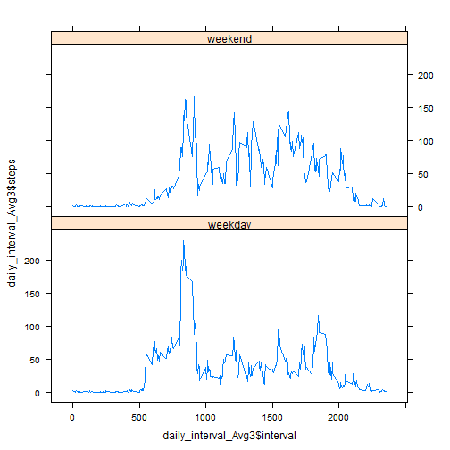

 Activity monitoring data analysis
========================================================
(Reproducible Research: Peer Assessment 1)
========================================================
It is now possible to collect a large amount of data about personal movement using activity monitoring devices such as a Fitbit, Nike Fuelband, or Jawbone Up. These type of devices are part of the "quantified self" movement - a group of enthusiasts who take measurements about themselves regularly to improve their health, to find patterns in their behavior, or because they are tech geeks. But these data remain under-utilized both because the raw data are hard to obtain and there is a lack of statistical methods and software for processing and interpreting the data.

This assignment makes use of data from a personal activity monitoring device. This device collects data at 5 minute intervals through out the day. The data consists of two months of data from an anonymous individual collected during the months of October and November, 2012 and include the number of steps taken in 5 minute intervals each day.


## Loading the date

```r
data <- read.csv("data/activity.csv")
summary(data)
```

```
##      steps               date          interval   
##  Min.   :  0.0   2012-10-01:  288   Min.   :   0  
##  1st Qu.:  0.0   2012-10-02:  288   1st Qu.: 589  
##  Median :  0.0   2012-10-03:  288   Median :1178  
##  Mean   : 37.4   2012-10-04:  288   Mean   :1178  
##  3rd Qu.: 12.0   2012-10-05:  288   3rd Qu.:1766  
##  Max.   :806.0   2012-10-06:  288   Max.   :2355  
##  NA's   :2304    (Other)   :15840
```


## Mean total number of steps taken per day:

### Histogram of the total number of steps taken each day

```r
library(lattice)
data_date_steps_sum <- aggregate(steps ~ date, data, sum)
barchart(data_date_steps_sum$date ~ data_date_steps_sum$steps)
```

 


### Mean and Median:

```r
summary(aggregate(steps ~ date, data, mean))
```

```
##          date        steps      
##  2012-10-02: 1   Min.   : 0.14  
##  2012-10-03: 1   1st Qu.:30.70  
##  2012-10-04: 1   Median :37.38  
##  2012-10-05: 1   Mean   :37.38  
##  2012-10-06: 1   3rd Qu.:46.16  
##  2012-10-07: 1   Max.   :73.59  
##  (Other)   :47
```

```r
summary(aggregate(steps ~ date, data, median))
```

```
##          date        steps  
##  2012-10-02: 1   Min.   :0  
##  2012-10-03: 1   1st Qu.:0  
##  2012-10-04: 1   Median :0  
##  2012-10-05: 1   Mean   :0  
##  2012-10-06: 1   3rd Qu.:0  
##  2012-10-07: 1   Max.   :0  
##  (Other)   :47
```

## The Average daily  activity
### Time series plot for "5-minute interval (x-axis)" X "the average number of steps taken, averaged across all days (y-axis)"

```r

daily_interval_Avg <- aggregate(steps ~ interval, data, mean)
plot(daily_interval_Avg$interval, daily_interval_Avg$steps, type = "l")
```

 


### Interval with the maximum number of steps

```r
daily_interval_Avg[which.max(daily_interval_Avg$steps), "interval"]
```

```
## [1] 835
```


## Imputing missing values

### Number of NA entries

```r
d_na <- data$steps[is.na(data$steps)]
length(d_na)
```

```
## [1] 2304
```

### Histogram of the total number of steps taken each day, after removing NA steps values:

```r
data2 <- read.csv("data/activity.csv")
data2$steps <- sapply(seq_len(17568), function(i) {
    if (is.na(data2[i, "steps"])) {
        daily_interval_Avg[which(!is.na(match(daily_interval_Avg[, "interval"], 
            data2[i, "interval"]))), "steps"]
    } else data2[i, "steps"]
})
data_date_steps_sum2 <- aggregate(steps ~ date, data2, sum)
barchart(data_date_steps_sum2$date ~ data_date_steps_sum2$steps)
```

 

```r
summary(data2)
```

```
##      steps               date          interval   
##  Min.   :  0.0   2012-10-01:  288   Min.   :   0  
##  1st Qu.:  0.0   2012-10-02:  288   1st Qu.: 589  
##  Median :  0.0   2012-10-03:  288   Median :1178  
##  Mean   : 37.4   2012-10-04:  288   Mean   :1178  
##  3rd Qu.: 27.0   2012-10-05:  288   3rd Qu.:1766  
##  Max.   :806.0   2012-10-06:  288   Max.   :2355  
##                  (Other)   :15840
```


### Mean and Median:

```r
summary(aggregate(steps ~ date, data2, mean))
```

```
##          date        steps      
##  2012-10-01: 1   Min.   : 0.14  
##  2012-10-02: 1   1st Qu.:34.09  
##  2012-10-03: 1   Median :37.38  
##  2012-10-04: 1   Mean   :37.38  
##  2012-10-05: 1   3rd Qu.:44.48  
##  2012-10-06: 1   Max.   :73.59  
##  (Other)   :55
```

```r
summary(aggregate(steps ~ date, data2, median))
```

```
##          date        steps      
##  2012-10-01: 1   Min.   : 0.00  
##  2012-10-02: 1   1st Qu.: 0.00  
##  2012-10-03: 1   Median : 0.00  
##  2012-10-04: 1   Mean   : 4.47  
##  2012-10-05: 1   3rd Qu.: 0.00  
##  2012-10-06: 1   Max.   :34.11  
##  (Other)   :55
```

Comparing those to the mean values before imputation, there is no big difference, which makes the method implemented transparent.


## activity patterns between weekdays and weekends

```r
library("lattice")
f <- factor(c("weekday", "weekend"))
data2[1, "weekday"] <- f[1]


data2$weekday <- sapply(seq_len(17568), function(i) {
    if (!is.na(match(weekdays(as.Date(data2[i, "date"])), c("Sunday", "Saturday")))) {
        f[2]
    } else {
        f[1]
    }
})
summary(data2)
```

```
##      steps               date          interval       weekday     
##  Min.   :  0.0   2012-10-01:  288   Min.   :   0   weekday:12960  
##  1st Qu.:  0.0   2012-10-02:  288   1st Qu.: 589   weekend: 4608  
##  Median :  0.0   2012-10-03:  288   Median :1178                  
##  Mean   : 37.4   2012-10-04:  288   Mean   :1178                  
##  3rd Qu.: 27.0   2012-10-05:  288   3rd Qu.:1766                  
##  Max.   :806.0   2012-10-06:  288   Max.   :2355                  
##                  (Other)   :15840
```

```r
daily_interval_Avg3 <- aggregate(steps ~ interval + weekday, data2, mean)
xyplot(daily_interval_Avg3$steps ~ daily_interval_Avg3$interval | daily_interval_Avg3$weekday, 
    layout = c(1, 2), type = "l")
```

 

The intervals between 500-1000 have increased activity in weekdays, which are between 8h-16h, so the numbers of steps are more during the day of weekdays when he might have more work.
It can be assumed that the person wakes up during the weekdays at 8am, and during weekends around 11h-12h
