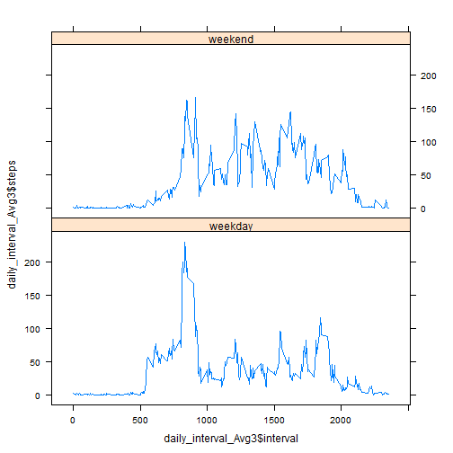

<html>
<head>
<meta http-equiv="Content-Type" content="text/html; charset=utf-8"/>
<meta http-equiv="x-ua-compatible" content="IE=9" >

<!-- R syntax highlighter -->

</head>

<body>
<h1> Activity monitoring data analysis</h1>

<h1>(Reproducible Research: Peer Assessment 1)</h1>

It is now possible to collect a large amount of data about personal movement using activity monitoring devices such as a Fitbit, Nike Fuelband, or Jawbone Up. These type of devices are part of the &ldquo;quantified self&rdquo; movement - a group of enthusiasts who take measurements about themselves regularly to improve their health, to find patterns in their behavior, or because they are tech geeks. But these data remain under-utilized both because the raw data are hard to obtain and there is a lack of statistical methods and software for processing and interpreting the data.

This assignment makes use of data from a personal activity monitoring device. This device collects data at 5 minute intervals through out the day. The data consists of two months of data from an anonymous individual collected during the months of October and November, 2012 and include the number of steps taken in 5 minute intervals each day.

<h2>Loading the date</h2>

<pre><code class="r">data &lt;- read.csv(&quot;data/activity.csv&quot;)
summary(data)
</code></pre>

<pre><code>##      steps               date          interval   
##  Min.   :  0.0   2012-10-01:  288   Min.   :   0  
##  1st Qu.:  0.0   2012-10-02:  288   1st Qu.: 589  
##  Median :  0.0   2012-10-03:  288   Median :1178  
##  Mean   : 37.4   2012-10-04:  288   Mean   :1178  
##  3rd Qu.: 12.0   2012-10-05:  288   3rd Qu.:1766  
##  Max.   :806.0   2012-10-06:  288   Max.   :2355  
##  NA&#39;s   :2304    (Other)   :15840
</code></pre>

<h2>Mean total number of steps taken per day:</h2>

<h3>Histogram of the total number of steps taken each day</h3>

<pre><code class="r">library(lattice)
data_date_steps_sum &lt;- aggregate(steps ~ date, data, sum)
barchart(data_date_steps_sum$date ~ data_date_steps_sum$steps)
</code></pre>

<img src="data:image/png;base64,iVBORw0KGgoAAAANSUhEUgAAAfgAAALQCAMAAABL4ZKLAAAAilBMVEUAAAAAADoAAGYAOmYAOpAAZrYA//86AAA6ADo6AGY6OpA6ZrY6kJA6kNtmAABmADpmAGZmOgBmOjpmOpBmZjpmZmZmtttmtv+QOgCQOjqQOmaQZpCQkDqQkGaQkLaQ29uQ2/+2ZgC2Zjq2///bkDrbtmbb/7bb/9vb////tmb/25D//7b//9v///879uV/AAAACXBIWXMAAAsSAAALEgHS3X78AAAYmElEQVR4nO2djXbbyJGFGWe0juWFPbFX8Xi1uxFtTlb8wfu/XtBA44eWKKLAKnR13/udiUICPGWqP4ECL0uFTU0g2aR+AiQNFA8KxYNC8aBQPCgUDwrFg0LxoFA8KBQPCsWDQvGgUDwoFA8KxYNC8aBQPCgUDwrFg0LxoFA8KBQPCsWDQvGgUDwoFA8KxYNC8aCsI97iXzGoifQ0Kd62pNunSfG2Jd0+TYq3Len2aVK8bUm3T5PibUu6fZq6z2tD3LGOeNVqRAGKB2Ul8b5Q/d4yZSXx/+EJiq8l4k9/bDa/PdfbzV+emnvH33/2W+p4t/8at4evVV8tteszKL6WiN/f1fX22/635+a/er959zNuafeFu/Fr/8jdsJfiHSJ7qd9921XhuD793+m/f8YtzZfu7rixf2S9rWK11K7PoPhaKL45lBvRrd7oOBzcge7uKL7ZHl7qH6pYLbXrMyi+lonfNpa7I753HLZsN3dT8e3dbfx5CEd9Wy216zMovpad3IVX9fg7vnXcbel2To/4+Mi7+vj5KVZL7foMiq8l4rfhHXDVn9V3B/emP3E/Ez88ctP/YKR7y/4q6quYIUzuQKF4UCgeFMisfgmq6+EAxKx+CcDipVl9/8i2WmpvNwMsXprV9+/422qpvd0MsPiAJKs/3D/3gS7F+8Muq29eAPoDnuL9YZfV7+7qw4f4g0Dx7rDL6vsfkbZa/iive3Lssvpwbv/tYjWSGCZ3oFA8KIxszVFdSTUY2VqTvXhpZLsLP+1VrJZ69ROSvXhpZNvcOD0WE9kuJ3vxAUlk23z5Uc6HNMspQbwssh12UrxDLNurhwOe4v1hF9nWx6/9ZzQU7w/D9urDx7EaMsrGlGByBwrFg0LxoDCrX4rqAq0Ps/qF4IgXt1fvNptymi1fgCNe3F7tdhSKCjjiA6JRKA884h1jl9W3AS+PeK8Ytlc30vdVrJZakz444heMQuER7xfDrH43GXBYINomVobJHSgUDwrFg8KsXgHVtVoJZvW3U7j4BaNQNv0sFIp3h11Wf/r+NFZL7caUwsUHJFn98cv7krP6CeWLF2X1++bwLzi5m1C8ePnY8oKz+gmFixdn9VXRWf2EwsUvGVte9dXKRlvKGjC5A4XiQaF4UJjVr4zqut4As/p1yVC8OKsfrz5G8QMZipfPwNk7vbZsSjIUHxDNwDnc/1n11VKvtxvyFC/K6pufjz6xpfiBLMUL++rDOWwVq6VebzdkKF48A2f8jIbiBzIUL87qp+JJj66+5TC5A4XiQaF4UJjVF05i8alPpmFREL+kr364GFHq7x8WBfELZuCMlx9L/f3DovRSL5xXT/HJ0REvnFe/5adzyVERL++r7z+Qp/hUqJzcLeirp/jEKIhf0lc//O0cScXt4m+ByZ07KB4UigeFWX2BzFIi3L4MntWvibJ4aVY/2Uvxq6IsnvPqc8HgpV6Y1YMMRvCGvnhhVj9eXJbi10RdvDSr7xN7il8X9ZM7WVY/2Uvxq6IsXprVT/byffy66Iq/BSZ37qB4UCgeFGb1BqiunRHM6vUpTLx8Bs7QZEvx/jCcgdPfrSneIXZZ/fQuxbvDMquneMdYZvUU7xjLGTgU7xjLGTgT8VhoS7KAyR0oFA8KxYNSTlav+oTLp5isnuJlmM7A6S8tS/H+MOyrj+/422oU7w27rL7P+NpqFO8Nu6y+f2RbjeK9YZfV84h3jeEMHP6O94zpDJzxrJ7v473B5A4UigelnMhWDdXv3C3FRLZqUPwvzI9sx71VXy21TQEU/wvzI9vuxi7TUSgU/wrzItvuRphju61itdQ2BVD8S2ZHtl28s9k8VLFaapsCKP4F8yPb4fWgitVS2xRA8b8wP7LtboRLk3yO0R3Fu8Miso03phcjygnlFXYKkztQKB4UigeFWX06VJdYrES4feG/kvpU3SO5iJdm9Su3V+dHLuKlWf3KrVf5kYv4gCSrP9w/c3r1W2QkXpTVN8d9f8BT/GvkI16W1e/u6sMHXlT4MrmIl2b1K/fV50cu4qVZfTjnzzKrXw1llTKY3IFC8aBQPCjM6ldFdVVvgln9mmQpXprV78JPeBWrpV5xJ2QpXprVN5wemdWfkaX4gCSrb/jBT+fOyVW8LKsfrzBK8ZFMxUv76ocDnuIjWYqXZvX18Wv/4RzFR7IUL+6rP3wcq5EOVXc3weQOFIoHheJBKTerV/0GyqPYrJ7i38awr3632STssqX4tzHsq087A4fi38ZwBs4Dj3jH2GX1bcDLI94rhn31jfR9FatRvDdMZ+DwiPeLYVa/m0y25Pt4bzC5A4XiQaF4UFJn9ar/DJlP4qye4lNhOgNn0w/BoXh32GX1p+9PYzWK94ZdVn/88v56Vk/xqbDL6vfvfl5P7ig+FZZ99TOyeopPhWFWX83I6ik+FYZZ/XZOVq/73ZDZMLkDheJBoXhQUmf16VD9BvOj2L76a1D83O1LsvphsmVqzS+h+LnbF/TVe55lS/GS7cIZOBTvF8sZOFvPlxGn+Pnbi7q2LMXP3b4oq69itdSaX0Lxc7cvyeqHz+MdoryQucHkDhSKB4XiQcHN6hejujLJgM3qFwMnXprVT/ZSvD+KnYFjBpz4gDCrTzkYwQxE8cKsvi7yosKA4qVZ/bbICxXAiZdm9ZO9FO8Pu6x+spfv4/3B5A4UigeF4kFhVq+N6sLZwaxemfLEi/vqx7sU7w+7rH68S/EOscvqx8dQvEMss3qKd4xlVk/xjrHL6ineNYZ99VPxQOj6MYPJHSgUDwrFg5JlVq/63EAxiWy7x8RHttUgT5xdYxHZdo/p3/i11SjeGxaRbfeYw/2zUZctxStgEdnGx+yHP6SheH9YRLbdY3Z39eGDyfAjilfAIrLtHtP/iLTVKN4bJpFt+5hwzj8MOOTbOW8wwAGF4kGheFCyjGzdo7p4NrC92oCyxEuz+l340a9itdQq1qUs8dKsvrlxeixwBs4MyhIfkGT1zY0fNp/Ouac48bKsfpyEQvH+sMvqJwc8xfvDLquvj1+fh2qpVaxLWeKlWX19+DhWA0PXkQlM7kCheFAoHhRm9T2q37B/mNVHKP7SdnFf/W5yMaLUWq9D8Ze2i/vq8xpbTvFvbZdk9bsHHvGOscvq24CXR7xXDPvqG+nhapNttdRar0Pxl7ZLs/o9j3jPGGb1u814NekMUF5Y7zC5A4XiQaF4UJjVS1BdlLQwqxeAKX7BDJxNPwSH4t1hl9Wfvj+N1VIr0wFTfECS1R+/vM8pq58DrHhRVr9vDv+Mkrs5oIqX9tVnldXPAVO8OKuvssrq54ApXpzVb/PK6uegvPgpYXIHCsWDQvGgMKuXobosKWFWLwJR/JKsfphsmVqYFojiF/TVG82yTQii+IBwBg7F+8VyBs52DHBSC9MCU7w8q29uddVSC9MCUfyirL6K1VIL0wJR/JKsfvg8vhi01z8ZTO5AoXhQKB4UZvUyVJclJczqRSCKl2b1k70U7w/OwBGBKD4gzOpLa7aEFS/M6mujiwonBFO8NKvflnehAkTx0qx+spfi/WGX1U/28n28P5jcgULxoFA8KMzqE6O6zhIlwu0L/5XUZ+NuyUD89aw+7ho66ocmW4q/SAbir2b1wyVlY0d9H93XFH+ZDMQH3szqx4i+Pn8MxV8mD/FvZ/VDRN931FP8dbIQfyWr73Ztu9ba0FhN8dfJQPzVrH78HV9R/FwyEH89q5+e1d/VZ+LJJbSFzoXJHSgUDwrFg8Ks/iqqK+EGZvXXgBcvzuqHuxTvELusfrhbU7xD7LL66V2Kd4ddVj+5S/H+sMvqecS7xi6r5+941xhm9dOz+pxRX3MXMLkDheJBoXhQCszqVZ95sVhEtt328LXqq/Es3BtGkW2zfZdoFArFz8Iosu0eWW+rWI3ivWET2Ybt4aX+oYrVKN4bNpFtPwQlxfRqip+FRWQbH3lXHz/H6I7i3WER2Q6PHC9GxLdz3mCAAwrFg0LxoBQY2a6J6iqtCturbwFCvDSrL6W9+i0gxEuz+lJar94CQnxAktUf7p/Lm179CyjiRVl98zLQH/AU7w+7rH53Vx8+FNBe/RYQ4qVZfSl99W8BIV6a1Ydz+yRZ/ZroC1kLJnegUDwoFA8Ks/p5qC6HB5jVzwJZvDSr34UDpYrVUou7FWTx0qy+uXF6LCWrRxYfkGT1zZcfxXw6By5eltWPVxileH9Y9tUPBzzF+8Muq6+PX5+HaqnF3QqyeHFf/eHjWC17tNc9OUzuQKF4UCgeFLSsXvXbyhmwrJ7iewz76nfdJYnaaqmF91B8j2FffaIZOG9C8T2GM3AeeMQ7xi6rbwNeHvFeMeyr/9bNsW6rpRbeQ/E9pjNweMT7xTCr300mW7pBfQFzhckdKBQPCsWDkk1Wr/p8SDZZPcUrYzoDZ9MPwaF4d9hl9afvT2M1iveGXVZ//PJeMauneGXssvr9u5+KyR3FK2PZV6+Z1VO8MoZZfaWZ1VO8MoZZ/VY1q1f/zsFhcgcKxYNC8aBkk9Xbo/oduyeXrN4eir+wXZzVj5edo3h/WM7A2Se5qPBSKP6N7aIZOIf7P6u+WmqrM6D4y9tFWX3zQ9AnthTvD8O++nCmXMVqqa3OgOIvbBfPwBk/o6F4fxhm9VPxOaC8ss5hcgcKxYNC8aAwq3+J6rfuFWb1L6D4c5b01Q9XoUotUwLFn7NgBk6e152j+JcI59VTvF/ssvrw0l/11VLLlEDxvyLvq+8/kKd4dxj31VexWmqZEij+nCV99cPfzmWF/io7hMkdKBQPCsWDwqzeFtVl1IRZvSkliJdm9ZO9FO8P06ze37z6tSlBfECY1fsbYrw2hYgXZvXjxWUp3h2WWX2f2FO8Q+yy+sleiveHXVY/2cv38f5gcgcKxYNC8aAwq/8V1W/cL8zqf4Hif0U+A2fM8SjeHYYzcNqNsVpqnfOh+NeQZPXjYyjeIZZZPcU7xjKrp3jHWM7AmYjPCN31dYvlDJyJePXnTW6EyR0oFA8KI1sBqmuSGEa28wEVv2AUSn+FUYr3h2F7dX+3pniH2EW207sU7w67yHZ6l+LdYRfZ8oh3jeEoFP6O94zpKJTxrL4M9Jc/HUzuQKF4UCgeFGb1Cqiu1Uowq7+dwsXPz+rHvVVfLbUbUwoXPz+r7+7uYEahFC4+MC+rH+7W2ypWS+3GlPLFz87qu1xvs3moYrXUbkwpXvz8rH54PahitdRuTClc/PysPt69q4+f48kexbvDIqsf7o4XIyobbSlrwOQOFIoHheJBYVY/C9XVcAGz+jlAi5dm9SX11UOLl2b1JfXcQYsPSLL6w/1zMdOr0cWLsvrmuO8PeIr3h11Wv7urDx8K6auHFi/N6kv6gwpo8dKsPpzzF5PVay97epjcgULxoFA8KMzqbVFdRk2Y1ZtSgnhpVr8LP/BVrJZaQCpKEC/N6htOj4Vk9YspQXxAktU3/Cjl07nFFCJeltWPVxileH9Y9tUPBzzF+8Muq6+PX5+HaqkFpKIE8eK++sPHsRosurYUYXIHCsWDQvGgMKtPhuoKy5UIty/8V1KfXTskG/HivvrdZlNKl60F2YgX99XDzMBZRjbiA6IZOA884t8iJ/GirL4NeHnEXyQj8cK++kb6vorVUq+yQ7IRv2AGDo/4N8hGvDir300mW5KXKJsUwuQOFIoHheJBYVY/D9Xl8ACz+lkgi18wA2e4T/HusMvqT9+fxmqpxd0KsviAJKs/fnlfTlYPLl6U1e/f/SwnucMWL59XX0xWjyxenNVXBWX1yOKXzKuv+mrZo7zs6WFyBwrFg0LxoDCrT4bqCsuVCLcv/FdSn5U7JBvx4qx+vOwcxb9CNuLlM3D2IBcVXkY24gOiGTiH+z+rvlrqVXZITuJFWX3zQ9AnthT/ChmJF/bVhzPXKlZLvcoOyUa8eAbO+BkNxb9CNuLFWf1UPHmJqkcxTO5AoXhQKB4UZvWqqK6aKczqNSlS/JK++uEqVKmNrESR4hfMwCnmunNzKVJ8QDivnuL9YpfVh9f6qq+W2shKFCpe3lfffyBP8e4w7quvYrXURlaiSPFL+uqHv51DQVuPHUzuQKF4UBjZekdVxESJcPvCfyX1WVe+pBcvjWwneyl+OenFc2x5EtKLDwgj23L+Pj4dLsQLI9vxGqMUvxgP4qWR7ZbXlr2d9OKlke1kL8UvJ714aWQ72cv38Tegbfyi4Le36/4rJBkUDwrFg8KsfjaqK5IcZvVzgRUvH4Uy9FpSvD8MR6HEgShttdTWFIAVH5Bk9eNjKN4hllk9xTvGMquneMdYjkKheMdYjkKZiC8B5ZVPDJM7UCgeFIoHhVn9dVSXwgvM6q+CLn7BKJT+LsX7w7CvfnxbT/H+sMvqh7s1xTvELquf3KV4f9hl9TziXWM4CoW/4z1jOgplPKvPGu01dwGTO1AoHhSKB4VZvQGqa2cEs3p9ChMvyOrbG2Fv1VdL7WJVChM/P6vvbuxgZ+AUJj4wL6vvboQ5ttsqVkvtYlXKEz8zq+9uhJf6hypWS+1iVYoTPzerH1N6tOnVHYWJn5/VdzfCpUk+x8yW4t1hktV3N6YXI8JC3ZIBTO5AoXhQKB4UZvWLUF2dJDCrXwKUeGlWvwtHRhWrpTalDJR4aVbf3Dg9ltBz9wpQ4gOSrL658aOIv6R5BTTxoqx+Mq6e4v1hmdUPBzzF+8Muq6+PX5+HaqlNKQMlXpzVHz6O1UpD2UICmNyBQvGgUDwozOoTo7rOEiXC7Qv/ldSn4W7JQLw0qw9hPS84eI0MxEuzel5bdg4ZiA+I+uofeMRfJw/xoqy+DXh5xF8hC/GyrD5I31exWur1dUsG4hf01fOIv0oG4sVZ/W7y17LkEtpC58LkDhSKB4XiQWFWb4jqGirDrN6OQsSLs/rmpL8fbUnx7rDL6k/fn8ZqqR0koRDxAUlWf/zyHjyrL0e8KKvfv/sJntwVI14+Awc7qy9EvDirr9Cz+kLEL5mBU/XVMNGWpQmTO1AoHhSKB4VZvRaqC2YPs3olyhUvzurHUbYU7w+7rD5srfpqqbXYU674gGgGzuH+z6qvllqLPUWLF2X1jfs+saV4fxj21YdT3SpWS63FnnLFi2fgjJ/RULw/DLP6qXgAdL2Yw+QOFIoHheJBYVZ/A6prtDK27dXDxYhSn3ObACJ+wSiU2HlH8Q4xjGxrineMXWQbXuurvlpqRybAiOclRs8BEb+ovbqK1VI7MgFE/JL26uFPqMpE3caKMMABheJBoXhQkke2qv8OmU3q9mqKT4RdVj/ZS/H+MM3qZ4wtp/hEmGb1M/4+nuITYZnVj9cYpXh3WGb12xnXlqX4RNhl9ZO9FO8Pu6x+spfv4/3B5A4UigcleWRLErGK+Is/EHnURHqaFG9b0u3TpHjbkm6fJsXblnT7NCnetqTbp0nxtiXdPk2+8waF4kGheFAoHhSKB4XiQaF4UNYQPzRuaJTatL0f3R9rjl8XM+kXV6saa+o907OOd6WnuYL4oVXrdrqrWsa27sl/y5/b2C+uVrWtqfpMpx3vWk9zBfFjF/bNdFe1jDN0J1+X1pv2i2tV7WpqP9Oh412r5Bri+y7s2+muatkVnH5dXnHsF9er2nakKj/ToeNdq2ReR3xgXykeR7X+ET/8LYLmMx073jM64hV/x3dXtVT8HT/pF9er2tbUfKbTjveMfscrn9VXiuffZ/3ialVjTb1netbxns9ZPfEIxYNC8aBQPCgUDwrFg0LxoFA8KBQPCsWDQvGgUDwo5YgfhzAdPrzyUeWV3W9sv8p+M16Ha3mVlaH4gaXKDn/75+O/ho/FKX5Vjp82f/37t/rwvjn2mtvvfra3Lu9uvwy7m0M2buq2H3//n/bzznb7+aNasc3/Tt//d7Op9uHT0sP9/z8+z67ihULEb6tmfb8dPz8FKc1/8dal3WHDbhjLGLpYmnvj9uOn3573jb9u+8tHBfF/NDfft3ePn/4RxM+r4oYyxHcztr/Fm9H42JX0Ynf4EZjs/tx2M4zbj5++hTbZuP3Fo7oj/qntpG23tk0X86q4oQzxreowQnsbXla7e5MX2Be7m9fizaR5pfkV8Jenetze2fwWt7941Avxp8d/ffo2s4oXyhAfD+lwjMWX+u7Wxd0vWhT3vz2P24OyrjG+Pu9p6x71i/j93enxuXl1n13FBWWIj7/EWyl/e4q/x5tbl3a3GwYZ7WD+Tmm3/fjprm8RffGooHP3bir++Lk5q2/8z6rihkLEn/5oT9t3m/B/pz/e/exuXdzdvBpPXn67Xwvj9uPn/4q9jNPz8XivKfKfv5+91Md3EPOqeKEQ8bpIz8dOj68d0E7P6iJFiw+H4tlZ3MzdZ8quFLkMxROHUDwoFA8KxYNC8aBQPCgUDwrFg0LxoFA8KP8GezxJt9Na2o0AAAAASUVORK5CYII=" alt="plot of chunk unnamed-chunk-2"/> 

<h3>Mean and Median:</h3>

<pre><code class="r">summary(aggregate(steps ~ date, data, mean))
</code></pre>

<pre><code>##          date        steps      
##  2012-10-02: 1   Min.   : 0.14  
##  2012-10-03: 1   1st Qu.:30.70  
##  2012-10-04: 1   Median :37.38  
##  2012-10-05: 1   Mean   :37.38  
##  2012-10-06: 1   3rd Qu.:46.16  
##  2012-10-07: 1   Max.   :73.59  
##  (Other)   :47
</code></pre>

<pre><code class="r">summary(aggregate(steps ~ date, data, median))
</code></pre>

<pre><code>##          date        steps  
##  2012-10-02: 1   Min.   :0  
##  2012-10-03: 1   1st Qu.:0  
##  2012-10-04: 1   Median :0  
##  2012-10-05: 1   Mean   :0  
##  2012-10-06: 1   3rd Qu.:0  
##  2012-10-07: 1   Max.   :0  
##  (Other)   :47
</code></pre>

<h2>The Average daily  activity</h2>

<h3>Time series plot for &ldquo;5-minute interval (x-axis)&rdquo; X &ldquo;the average number of steps taken, averaged across all days (y-axis)&rdquo;</h3>

<pre><code class="r">
daily_interval_Avg &lt;- aggregate(steps ~ interval, data, mean)
plot(daily_interval_Avg$interval, daily_interval_Avg$steps, type = &quot;l&quot;)
</code></pre>

<img src="data:image/png;base64,iVBORw0KGgoAAAANSUhEUgAAAfgAAAGwCAMAAABy/YdMAAAAkFBMVEX9/v0AAAAAADkAAGUAOTkAOWUAOY8AZo8AZrU5AAA5ADk5AGU5OWU5OY85ZrU5j9plAABlADllAGVlOQBlOTllOY9lZmVltdpltf2POQCPOTmPOWWPZgCPZo+PtY+P27WP29qP2/21ZgC1Zjm1/rW1/v3ajzna24/a/rXa/tra/v39tWX924/9/rX9/tr9/v0Vpu6fAAAAMHRSTlP//////////////////////////////////////////////////////////////wBipdB4AAAACXBIWXMAAAsSAAALEgHS3X78AAAQ9UlEQVR4nO2dC3vbthWGC3fLnHSunXTd5GTpKq3RUuvC///vRvAC8QJSAAGQh/y+90lsSSQPYL4CAZAA+UNGIPlh6QyQZaB4UCgeFIoHheJBoXhQKB4UigeF4kGheFAoHhSKB4XiQaF4UCgeFIoHheJBoXhQKB4UigeF4kGheFAoHhSKB4XiQaF4UCgeFIoHheJBoXhQKB4UigeF4kGheFAoHhSKB4XiQaF4UCgeFIoHheJBoXhQKB4UigeF4kGheFAoHhSKB4XiQaF4UCgeFIoHheJBoXhQKB4UigeF4kGheFBCxCsimYTiA7YlqaF4UCgeFIoHheJBoXhQKB4UigeF4kEJFn9+X5wH+vGbb2iyKKHir6+74vfp3Ztn6KUQmq25CRV/+fSt9ds99FIIzdbcsMSDElzHX15WVscLzdbc4LXqhWZrbigeFLzunNBszQ1g405ovmYmQXfOcXDPUkjN18ywxIMC2J0Tmq+ZAWzVC83XzFA8KDG6cw/7VZ2rF5qvmYnRuLu+PlP82ojTnTs8UvzKiNSdO/7lJ4pfFRG6c8/617HfnxO6gym+gK16UODEK6H5mhuKB4XiQaF4UCgeFIoHBVC80IzNDMWDQvGgUDwoFA8KxYNC8aBQPCgUDwrFg0LxoFA8KBQPCsWDQvGgUDwoFA8KonihOZsXigeF4kGheFAoHhQ08YriSygeFIoHheJBoXhQKB4UOPHmBzgUDwqkeJlZmxcw8YriKygeFIoHBVO8yLzNC8WDQvGgUDwooOJFZm5WKB4UigclWPy6ni1L8TWh4lf2pMnbUwok5m5OQsVbni3rGHoRKL4GrcRbXmESXMev69myFF/jJv747u2o1C5q6EVQ1peIOIm/fNzn/879R8uFhF4Eiq9xE//pW17mreJ1o04f7ftVvMg9S/E1jod69bA/WQ/1ufiiQX/+2Tf0IlB8TYTu3PnprdWdUzXhuYuOGniNR7D4l4ffv+gS/7Sy7pzM/M2Hm/jra16AH+2r5Mses9PqunMy8zcfTuL1A+Lzin7A/MTQi0DxNa6t+sx6VjYk9CKowTdoOLbqH7PtlXiRGZwNtxL/UrXTLTX55NCLQPE14a36we+ExP1K8TXBF2nKht+E0IugRt5h4dyde/f94966ymXgc4m7VY2+hcK1O3d+erNccg8JvQQUb3DtzuXiN9Cdo3iDR4k/ssRvCI9Ttp7eJe5WijdgjauneAPWKVuKNziIN+doWMdvCI8SHzn0ElC8gXU8KFjDqynegDW8muINocOrp4deAoo3hA6vnh56CSjewMYdKBQPiov484d9dlL50T5q6CWgeIODeD0FXo+24PX4LeEg/mjmRHmNtZS4Wyne4FLiP++z47P1phchoZeA4g1Odfx7fX3mwDp+S7BVDwrFg+I1k4aNu+3gVuIPz5meO+fXvBO4Wyne4DX06g+vARkCdyvFG1yHV2f6ovz/+re9mB56CSje4Ni4O+g7YlxevK7PCdytFG9gqx4UigfFsTvnO4vGIfQSULzBscTrxxF43glF4m6leIPHod52S7OA0EtA8QaWeFBYx4PCVj0o7uKPntdoJO5Wijc4ip8w1lLibu1mSWAW58JxBM7D/uA5nULkXqV4g4P48tocxW8LlxKvx2HsKH5buDbuDqzjt4V7q/76urlWvcQszoVfP/7kc7wXuFcp3kDxoFA8KBQPCsWDgi1eYh5nIli8vlK/mseIU7wh9LKsvmuCxjLJRuBOpXiDy7n6sWdQ1Xc7tdz1VOBO7WdJYCbnAbzES8zkPASPwKmOByut4yVmch7cxB8nzJKWuE8p3uA22PLj/vS4hUeMUrzBdZp0+c+yxrq7c3NlUt6+cJsm/Xmf/7PexJiNu4kJL41bHZ87Pyn1bFnB0p0zt8WLlMWILCVe4L5A787Nk0tv8elzBdWds+WI4q1sawoVxTunsK1JkxTvnMK2pklTvHMKLPFxEl6p+JE6fuTS3RbFT/ybVit+5MaG5T3wJoReAIp3TsGcuRteRT+8YkroBYggftoftVbxw331gNALsCLxyXde8AmcyaEXYDXiVfqdR/F+AcDEX1/Vu+9DdfnE0AuwlHjvzaSIz1vu56e39T+MiOKbSYxiunO5+LFO3YTQC0DxzSRGaZb4I0s8mnhdxyvle4WO4idvJkZ8itALQPHNJEZpP5OGdTyUeHMdhnX8HOJVuUHqMYvBF2kmh16AFYkvXqW0zzreL8Cc4rMs4U50E3/iRZpqZSzxns8dcwu9AMuJ99hOlHjW8fXKWOLLZ8tGDr0AKxSfbC86Huq3W8d7ZXMG8UqS+CShF2BB8c4bqs63hOIjIFN8e4kg8ZdPf/BQX687h3glRHyi0AsQQfykv2r94ld+Z8slxQ9vSPHJESleUXxyxIpXrbcUH5uFxKvGr/7mFJ8c+zXOxcW3+wqq03Og+HBWIr5T5/un55OpIbYkfmBUgzTx3Va+f3o+mRpiS/34pcUPdOcli7+8+N4NwyH07AycdqN4G1t4mvTtSEvxznFbT5pUymsgDsV3U7BuLlt88SRxz5E4FN9NQdl6FpLFr/sGh6r1a2ixayjlvdGKxScJPRt3VAkQr2SKH30Y0fTQsyFHfKbuiu9VJizxk0ki3nMr84ri50OZH8OL3UMBiV/70Cvx4jOh4hOFToG9v2Y/cTK6jX3NW6CJ4ntNt4ziozAofiQvztlsthVQxK/luXMpxbdOB3hPgxxOTrL41Tx3Lp1448YufjTIisWPPHducugUJBOvOq964seirFf8yHPnpodOwZB4Zy331xkq8c5fre53RLL4kefOTQ+dggXFO/cbLOJ7BxTP7E1hU636gSE2ScT3D+CDgSg+NUPi3Zte99cZFj8Yaa3i13ORZmhQXUzxRlSrma96qw0n0PnGyBWfVXfEkN+dsym+2+OOKH6gjTH2XnWOFbLEr+XOllsUn2o3unXniidN2e9eLen58T3JKqH4pmxlWW8wgRWJL+9ebT3Si3qatEX8nSZ9FkX8rW1hC7Zm8cNYnh/vGDoB4eIdmmcUXyCuxHfbzBRvJ1S8qOfH98WrhOIr/d7imx+obLXiJ4dOgEW8Z+POvjbFu4WsmZShEGzi746ZuCveMmE9ovjOJ6sRrxt1+mhv6eotIr49zqp4k1h8plriHcyNiLfkVa74okF//tk3dAKMeGU+uJ8NirfhIv789CamO1cPiGyZubtR842H+KxOq3k9HUb8y8PvX3SJfxLRnTMjYW/OfcVbPN0R31xsHT49/Ml6xRdn9R6zk5DuXP+/TPGqvfIqxU8NnYCu8AniLZ2RzkcxxLdbIo2VBsVH35lbEN9uxGe3fTVFvKVKji5eWYMOZdbpr/Bme+Jv7twyECC+PKpYxNsKc3udzqcUPymh5m7zPnPkIL63wS1B1V3uKH4gExTvlZA88ePNNYqPQ+vYbmuX39m6+aYv3lJp36z2zwmr6vg/uPnoRxTvl1Ak8daruGPiLRcDKH7Wxt1t5/QbTve3vr0caXc112ottIofUzn40cgoYYq3JxRFvPIXX23WejdZ/EC+KX4sofq/f8I3j1HFN6sfS34tHw1l29KCjADFt8X3N48v3p6JwRUpfiwhqeId8zLmleJHE5pcD5rCVo/fCRTfanK4+qL4yQmtXPx4Bil+JCGv29K0to4qvt3JcM3SHfH3xwp7Q/HmIkz9DQgVb1aI1Auj+DsJTT0aKtUuoL7ie2ukFR9pt1J8OvGRKmaKv5dQPPHNS3x98X3R3fcJxHf+yuDIFF97ava9ywa5tcqn+NDQ8QhMqNGW7zQTQ8XH2QUUnyihYfH25tlC4tuHEYoPT8dXvEW0LWA0KD5ROn3xzYbd8uI7rQ2Kj5WOavW8M4niO19Le7Y8g44vhhdva5gLEB/eX6D4pvhuRDeFc4mv9FN8pHRGxLvt4CXEx/irx0ARPxRjUslKIL4OnFVNPYqPk45w8a1X1ZFe9ZdODGoFXvykaBQ/C0Di6/YIxUdKZzDEtNiR/3KKT5ZOOlORw1Wnblrik3w5QcRHJmGOzLkc1f5gQqBRKH4KKcWbU/WqTovixTBPjuqTOhQvhplypOre3aSNxxevQLw87/NlqX+22WfTMSheNp052T5bji+meOGUnTuKh4TiQaF4UCgeFIoHZdJc2tWLp/dp/TmKXz8UD0pfvMNOofj10xPv0tij+PWjsvZgDae2HsVvA4oHRbVeUTwMFI9Ka9TtBsX3glJ8iWr+rkbi9peOfdJCoPhW2Oh3+lwtffGNe3eNPAVnAIniG9VZ/Bs+rhbjuPphlPdKf2O9YSKLD9RUTiJRrbdhEbeEut0cq3lKZ2BcXrD483udoLr/bFnVyVCZV8sGts+yzEwPVu0vN2nSG3Zfv/ZtG90Vf33dFb9P7+49TVpl7fJaF9hbDlWd93ahzm5f5tq6SnFb3y3RLFH2Udih4uvnxjeeH69qepmp3VeLi/cNsttmjRBDtxdlu26ElvjGz+6ng0Qs8UQUwXX85cWxjieiWFt3jkSC4kGheFAoHhSKB4XiQaF4UCgelJTiiWTSie9+D+KFShQQMosDULysgBSfIiBkFgegeFkBKT5FQMgsDkDxsgJSfIqAkFkcIKJ4siYoHhSKB4XiQaF4UCgeFIoHheJBoXhQKB6UWOIvL6o/uW4SR1XM16oCRoh7/ulb1gkXFrUIGDGbeiL6Lm4W7xNJvJ5aeXyMEuqwawSMEPek/bTDhUUtAkbM5uXjPjt/2MfMogORxOtJ1EVBCOb6ed8IGB738PBbvn07XFDUMmDEbJ6038MuYhZdiCT+/PRWfHPDKSbn7uqAMeLq/dcOFxhVB4yczV7e4u3QASKJ17Pn4+QzP+jp4lQFjBFXe2qHC4xafJOiZvP6+hw3i/cRV+ILDjvpJT5qNi8vz1ncLN5HXB1f0K3xgoKd49bxLfFRAp7f64biOut4fayK0wjVx7jrl29VwBhx9f5rhwuMWtcdkbJZeo+bxfuI7Mc/7GN2Z5P14yNl81jMe9mtsx9P1gbFg0LxoFA8KBQPCsWDQvGgUDwoFA8KxYNC8aBQPCgUDwrFg0LxoFA8KBQPCsWDQvGgUDwoGxFfPxaxGAnZGZZ8ezs8Xrm5pD+c/VTOmvGMI5vNic9G9r6bsNM/nzsLP/z+9funb/a1XVOQxhbEX17UX3/ZVbONyxJ/KKe1FehPnv6dL8vX+/Fb8SM7//0XPXr5+nlvtqqjXT//59c3vXG+UEf+x/789OfXN+84wtmC+MNzfjDeFbONC+v5v1P+0XO1WH/yvpibprUciokK5/c7Pd/1/PTdbFVHy50fqoVvOvJDrv9ftXiPOMLZgHg926g61Ocvy71/+fXtv3VNXfmoFuSCyrWy47P+Z7aqw+WfnR7LhUVkPR/6oNSzbxzhbEB8sbP1fQoO+h4VpZfieH1b3hCmpzc/7MuJlH9WUn9sCLu+Fre6KBZWB/z8w6/fX3Z+caSzAfFVib+87G6H+ux4a6G1hZWNtGI+3effnt5uW9Vr66aBPtbrhWWJPz1ev+ZHfb840tmA+KqOr2at13o+mD5ZS1ixcllLZ8fy+F1tVa191HWGPtbnC7Oqjv+Yt+o/7v3iSGcL4vOjs27VH5X+VXm5frm11oyw62vRGn/Yl9VD8eUwW1Wxiu30BPUP5ZTIv+m2W6O/4BhHPFsQb+P8c6xAWuX1a8qJq4uwUfHHh7KcqnIyswO2tXVDz3Hz1bFR8eQeFA8KxYNC8aBQPCgUDwrFg0LxoFA8KBQPCsWDQvGgUDwoFA8KxYNC8aD8HxVpkW5OT9NuAAAAAElFTkSuQmCC" alt="plot of chunk unnamed-chunk-4"/> 

<h3>Interval with the maximum number of steps</h3>

<pre><code class="r">daily_interval_Avg[which.max(daily_interval_Avg$steps), &quot;interval&quot;]
</code></pre>

<pre><code>## [1] 835
</code></pre>

<h2>Imputing missing values</h2>

<h3>Number of NA entries</h3>

<pre><code class="r">d_na &lt;- data$steps[is.na(data$steps)]
length(d_na)
</code></pre>

<pre><code>## [1] 2304
</code></pre>

<h3>Histogram of the total number of steps taken each day, after removing NA steps values:</h3>

<pre><code class="r">data2 &lt;- read.csv(&quot;data/activity.csv&quot;)
data2$steps &lt;- sapply(seq_len(17568), function(i) {
    if (is.na(data2[i, &quot;steps&quot;])) {
        daily_interval_Avg[which(!is.na(match(daily_interval_Avg[, &quot;interval&quot;], 
            data2[i, &quot;interval&quot;]))), &quot;steps&quot;]
    } else data2[i, &quot;steps&quot;]
})
data_date_steps_sum2 &lt;- aggregate(steps ~ date, data2, sum)
barchart(data_date_steps_sum2$date ~ data_date_steps_sum2$steps)
</code></pre>

<img src="data:image/png;base64,iVBORw0KGgoAAAANSUhEUgAAAfgAAALQCAMAAABL4ZKLAAAAilBMVEUAAAAAADoAAGYAOmYAOpAAZrYA//86AAA6ADo6AGY6OpA6ZrY6kJA6kNtmAABmADpmAGZmOgBmOjpmOpBmZjpmZmZmtttmtv+QOgCQOjqQOmaQZpCQkDqQkGaQkLaQ29uQ2/+2ZgC2Zjq2///bkDrbtmbb/7bb/9vb////tmb/25D//7b//9v///879uV/AAAACXBIWXMAAAsSAAALEgHS3X78AAAaYElEQVR4nO2dDXvbupFG1exV0zjL+G6yrpN627VipWt98P//vSVIkITsSOJQM5wB5j3PrSt+PGMaJ5Sh1wC4qoFLVtoXAHSAeKdAvFMg3ikQ7xSIdwrEOwXinQLxToF4p0C8UyDeKRDvFIh3CsQ7BeKdAvFOgXinQLxTIN4pEO8UiHcKxDsF4p0C8U6BeKdAvFMg3inLiJf4LgI1PV0mxMuWNHuZEC9b0uxlQrxsSbOXCfGyJc1eJsTLljR7mbzXtQLmWEY8azXAwELiS4K1ZdRYSPxfy8Gd+OP31eqP13qz+stzs3X486XfU8fN/mvdnLN6rPsz22rathhxJ363blw+7v54bf6rd6sPL3FPeyxsxq/tmc0/gXhmV03bFiPuxAe2j9sqSD3+6/iPl7in+dJtjjvbe787M1bTtsWIR/HNrdyIbvVGx+GmD3Sbg/jNqhrObKtp22LEofhNY7m/jzunYc9mtU7Ft5vhPNzxpqF07sK7ev+bu31vb/d0B9M7flcF8Se/40uC2YAS08Vvwg9d9X317uZu99T127f65sD6tFfPfdngVpDcOQXineIysmX92TJFIrnr9oevVV9Nuyt+AsTXYslds387HIV4gwgld92Z9aaK1bRdnwDxtVRyF/aHt/qHKlbTdn0CxNdSyd0m/nsId31bTdv1CRBfyyR38cx1fbiPCY52N/4NzG2YJRLJ3XDm6vFsNaAMAhynQLxTXCZ3c2BtDwPIJXdljblzLJ6a3JU15s6x+AAludvfvfbxDsTbQy65a94A+hse4u0hl9xt1/X+UzFj7hyLpyZ3ZQ22dCyemtyFvv2Q3OUPe8srgwDHKRDvFCR34rC2JBuYJi1N9uKpke02/GuvYjXt1lcke/HUyLZ5cXwqJrKdT/biA5TItvnys5w/0synBPG0yHY4CPEGkRxsOdzwEG8Puci2Pnzr/0aDj3P2EBxsuf989bsANZDcOQXinYLIdi6sDbQ8goMtt6tVOUOv3uFHPHmwpdlp0iz4ER8gTZN+wB1vGLnkro17cMdbRXCw5WO34l1bTVsTP37Ez5gmPd7xBcIsYmkEk7ttsvgR92WDW0GA4xSIdwqSOwZY22ohRKdJr/p50gX26hMKF09N7o4/nsdq2m5EKVx8gJLcHb5+LDm5SyhfPCm52zW3f8HJXULx4ukLHBac3CUULp6c3FVFZ/UJhYufs8Bh1VcrG24pS4AAxykQ7xQkdwvD2q43gGnSy5KheHJkOy5XD/EDGYqnT5PeGX0YkSYZig+Qpknv735VfTXt9jZDnuJJkW14hHzVV9NubzNkKZ442DL0YatYTbu9zZChePI06TGqx8e5ET51tyEY2abieS8a3A6SO6dAvFMQ2RbO7eLnDLYcVq/W7ky7hUH8jGnSBa1XnysM4gPEBQ4hXh0e8cQFDjfI6tVhEV/K06Q9wdK5mzHYshcPtLhd/JzBluuz1YAyCHCcAvFOQXJXIJOUTN5PTe6So+jVLwqzeCxwmAvM4gPE5M7J3Dlr8IsnJnfjs0kgfknYxVOTuz6/g/hlYe/c0ZK75CjELwqzeGpylxzFx7ll4RV/CwhwzAHxTkFyJwBr2wmBadL8FCaePk16GHkF8fYQnCbdb9YQbxC5yDbdhHhzSEa2EG8YycgW4g0jOU06Ee8LTkFSSE6TTsRzXza4FSR3ToF4p5QT2bJecPmITpPuH0mzRK8e4mkIDraM/f+2GsRbQy656z/xt9Ug3hpyyV1/ZlsN4q0hl9zhjjeN4DTp9Hc8evXWEJ0mPfbq2a8b3AgCHKdAvFPKSe7YYP3JzSKR3I1Hq76afK+eDYh/w/TkrnuxzXSaNMT/hmnJXfcirHi1qWI1bZsEIP49k5O77lP+avVQxWraNglA/DumJ3fD+0EVq2nbJADxb5ie3HUvwiLG9zHBgXhzSCR38UW6bHlOMLewURDgOAXinYLkTg/WJiYrIe6f+V20e2wWyUU8NbJdeLBlfuQinhrZLjzYMj9yER+gRLb7u1cscHiJjMSTItvmvu9veIj/HfmIp0W223W9/4SnUJ0nF/HUyPZklC34DbwmichFtqHP/3i2GlAGyZ1TIN4piGwXhbVVb0IuuduGH7SK1bR70EbIUjw1uWs4PiG5OyFL8QFKctfwE1n9KbmKpyV34yNpID6SqXjqYMvhhof4SJbiqcldffjWR/Xo1fdwqrsNwcGW+89XvwtQAwGOUyDeKeUmd6w/QHkIjrnbrlaKI3Ag/jKCY+50p0lD/GUEp0k/4I43jFxy18Y9uOOtIjjmrpG+q2I1iLeG6DRp3PF2EUzutsniR/g4Zw0EOE6BeKdoJ3es3wZMR3maNMRrITpNetXPk4Z4c8hFtscfz2M1iLeGXGR7+PrxemQL8VrIRba7Dy/XAxyI10JysOWEyBbitRCMbKskssXHOWsIRrabJLLlvWhwO0junKKd3GUIa8uooZzcZYg78eTkblyuHuLtITlNepflw4iu4U58gDRNen/3q+qradtixKN4UnLX/Pvo8xuIt4fgYMvQA65iNW1bjLgTT54mPSa2+DhnD8HkLhXPecmAAyR3ToF4p/iNbFl/wPyQHXM3LGKs3RV/D8RP3T9jmvS4bLm25vdAPGU/cYFDiLeLXHIX3uurvpq25vdA/PT9RT1NGuKn7p815q6K1bQ1vwfip+6fM+ZuGFdvEOaGzA0EOE6BeKf4Te5mw9oyamCwJRV34qmRbXIU4u0hGtlqrmwphjvxAWJkq7ncmRgexRMj27rIx4g7FE+NbDdFPozInXhqZJscxcc5e8hFtslRBDj2QHLnFCR33LA2nBxI7pgpTzx9mvSwCfH2EJwmPWxCvEHkkrvxHIg3iGRyB/GGkUzuIN4wktOkE/GO4LQjiOQ06UQ870WD20Fy5xSIdwoiWzKsLaOG6DTp/skkRfXq3Yknj7mL/f+2mrYtRtyJD5CeJl2ZniY9G4/iScldf2ZbTdsWIw7FExc4xB1vGcFp0vgdbxnRadJjr74kmA0ogQDHKRDvFCR3ZFhbRg0MtqTiTjwhsm3PCUervpq2LUbciZ8e2XbnbDFN2jISkW13TljqbFPFatq2GPEofmJk250T3uofqlhN2xYjDsVPjWzHsNbwAoezcSd+emTbnRNWr76P0Z32JzBWuBXoIBLZduek69VzXza4FSR3TskyuWO9NqfkmNxBPANyyZ3cYEuIZ0AuuZMbiAHxDMgld/u7V6F17iCeAbnkrnkD6G94iLeHXHK3Xdf7TyKDLSGeAbnk7mSULT7OWUMuuQt9fiR3ZkFy5xSId0qWka15WBtPBrnkbhtaoIrVWHv15ilLPDW5a14cnwqcQjWBssQHKMld8+JniQsjTKA48bTkbnwyCcTbQ3LM3XDDQ7w95JK7+vDtdaimrWJZyhJPHnO3/zxWcwavIxEQ4DgF4p2C5K6H9Qe2T46DLUWA+HP7yYMtt6tVRo8Yhfhz+8mDLfOaJg3xl/aTpkk/4I43jFxk2+Z8uOOtIjjYspG+q2I1ba3Xgfhz+2dMkx7v+AzgblnjCEa222TxI+arBjeD5M4pSO4osDaKLkjuCPgUP2Oa9KqfJw3x5pBL7o4/nsdq2sp48Ck+QEnuDl8/5pTcTcGteFJyt/vwklNyNwWv4ukLHGaU3E3Bp3hyclflldxNgbnxNRFM7jZI7gyD5M4pEO8URLZkWFtGDcHkbly1vJRefYs78fRp0js8k8YugtOk93e/qr6ati1GPIonJXeN+z6/gXh7CI65Cx2hKlbTtsWIO/HkadJjYgvx9hBM7lLxJcHa/mogwHEKxDsFyR0N1mbRBIMtSXgUP2ew5bB6tbYwLjyKnzFNelyvXlsYFx7FB4grW0K8XeQi2/BeX/XVtIVx4VM8nibtUvyswZZVrFYMvK2viOxgy/XZakAZJHdOQXJHg7VZNEFyR8KjeGpylxyFeHuIJnc5LXA4DY/iA8TkrrTZsm7FE5O78aE0EG8OyeRuU97DiDyKpyZ3yVF8nLOHXHKXHEWAYw8kd06BeKcgsiXD2jJqSE6THgbglNOr/2sxHXvBadL9Zg3xBpFL7sZzIN4gkskdxBtGMrmDeMNITpOGeMNITpNOxJcEswElEOA4BeKdguROGdZ2piiZvP96ctevgNLPky0zueMlA/FXk7txzaNunmyhyR0vGYgPXEzuxqF2dcnJHS95iL+c3A1D7fp5shB/nSzEX0nuukObbsJcmC4J8dfJQPzV5O5kXUOIn0YG4q8nd2mvfl0Xm9zxwi10KghwnALxTkFydxXWljADpklfw714cmQ7bEK8QeQi22GzhniDyEW26SbEm0Musk02Id4ecpEt7njTyEW2J7/jc4a9zU0gGNmmvXr26wY3guTOKRDvlAIjW9YrLxaJ5K7bH75WfTX0wq0hlNw1+7dKCxxC/CSEkrvuzHpTxWoQbw2Z5C7sD2/1D1WsBvHWkEnu+qUNNR5NAvGTkEju4pnr+nAfExyIN4dEcjecOT5wEB/nrIEAxykQ75QCk7slYW2lRZFL7koZc3cJF+KpyV0pY+4u4UJ8gJLc7e9ey3tCxRu8iCcld83bQH/DQ7w95JK77brefypgzN0lXIinJnelDLa8hAvx1OQu9O1Vkrsl4ReyFAhwnALxTkFyNw3W5rAApklPwrN4amS7DTdKFatpi7sVz+KpkW3z4vhUSmTrWXyAEtk2X34W80ca5+Jpke34MGmIt4fkYMvhhod4e8hFtvXh2+tQLXt4W90AgoMt95+vfhegBpI7p0C8U7xFtqw/Vs4IDrbcdmtYt9W0e+U9EN8jONhSaZr0RSC+R3Ca9APueMPIJXdt3IM73iqCgy0fuxXv2mrawnsgvkd0mjTueLsIJnfbZPEjM7A3YK4gwHEKxDslm+SO9XqA7DTpVT9P+vbOHcQzI5fcHX88j9Ug3hpyyd3h60fG5A7imZFL7nYfXhg/x0M8M5Jj7jiTO4hnRjC5qziTO4hnRjC527Amd+w/uXMQ4DgF4p2STXInD+tPbB5Mk+6B+DP7yZHtuFw9xNtDcpr0TuVhRHOB+Av7SdOk93e/qr6attUJQPz5/aTINjxCvuqraVudAMSf3U8cbBl6ylWspm11AhB/Zj95mvQY1ePjnD0EI9tUPPNVg5tBcucUiHcKItv3sP7oVpEdbDmsXq3dZacA8afMmCad53r1EP8e4gKHEG8XueQuvPVXfTVtmRQg/i15PE36ZiD+lFmDLatYTVsmBYg/Zc5gy2FCRVbwt7JBEOA4BeKdguROFtZm5EQuuUuO5tW546QE8UUscLg0JYgPEJM7e6teLU0h4onJ3fhsEog3h2Ry1+d3EG8QueQuOQrx9pBL7pKj+DhnDwQ4ToF4pyC5ewvrD24XTJN+A8S/hT5NeoxzIN4cgtOk252xmrbO6UD876BEtuM5EG8QycgW4g0jGdlCvGEkp0kn4jOCt33NIjlNOhHPft3gRpDcOQXinYLIlgBrmygjOk26fyRNTr36CzgVTx5s2W/WEG8QueQu3YR4c8gld+kmxJtDLrnDHW8awWnS+B1vGdFp0mOvvgz4m18PBDhOgXinILljgLWtFkIiuRuPVn017X6ZKIWLn57cdZtbN9OkCxcfmJbcDZv1porVtN2IUr74ycld9yl/tXqoYjVtN6IUL356cje8H1SxmrYbUQoXPz25i5vr+nAfO3sQbw6J5G7YHJctLxtuKUuAAMcpEO8UJHeTYG0NE2Ca9BRci6dGtiUNtnQtnhrZljQQw7X4ACWy3d+9FrPAoXfxpMi2ue/7Gx7i7SEX2W7X9f5TIYMtXYunRrYno2xzh7vZ9ZGLbEOf//FsNaAMkjunQLxTENnKwtqMnMgld9vwc1exmna3XIsSxFOTu4bjUyHJ3WxKEB+gJHcNP0vJ6mdTiHhacjc+kgbi7SE52HK44SHeHnLJXX349jpU0xagRQniyYMt95/Ham7htcUIAhynQLxTkNypwdrCdCWT95PH3G1Xq1JG4EiQjXjymDs306TnkY34AGma9APu+EvkJJ6U3LVxD+74s2QknjjmrpG+q2I17VY2SDbiZ0yTxh1/gWzEk5O7bbL4EXgPs0kiCHCcAvFOQXI3DdbmsACmSU/Cs/gZ06SHbYg3h1xke/zxPFbTFncrnsUHKJHt4evHciJb5+JJke3uw0s5AY5v8fSVLYuJbD2LJ0e2VRLZZg9zs+sjGNluksiW+arBzSC5cwrEOwWRrRqsLUxXMnk/Obkbl6vPv1cvQDbi6dOkd04eRjSPbMQHSNOk93e/qr6adisbJCfxpOSu+UfQ5zcQ/xsyEk8cbBk6MFWspt3KBslGPHma9JjYolf/Ozg10hFM7lLxrNcMGECA4xSIdwqSO1ZYW00U2TF3wyLG2l3ohShS/Ixp0uOy5dpGFqJI8QHiAocQbxe55C6811d9NW0jC1GoeDxN+hpFip815q6K1bSNLESR4ueMuRvG1XuBW48cCHCcAvFOQXJnHVYRiRLi/pnfRbvXlS/64qmRbXIU4uejLx4rW6qgLz5AjGzLmS2rhwnxxMi2LuYx4opYEE+NbDd4GNHt6IunRrbJUXycuwFW3ZcEn9tPjWyTowhw7IHkzikQ7xREtpNhbRF1JKdJDyOviujVuxVPnibdP1O6hniDyCV34zkQbxDJ5A7iDSOZ3EG8YSSnSSfiS4C34bWRnCadiGe+anAzCHCcAvFOQXJ3HdamsILoNOl+M+9evXfx5DF3Yycf4u0hl9wNmzXEG0QuuUs2Id4ecskd7njTCE6Txu94y4hOkx579VnD3eYmQIDjFIh3CpI7AVjbTghMk+anMPGEyLZ9EY5WfTVtF4tSmPjpkW33Yut2mnRh4gPTItvuRVjqbFPFatouFqU88RMj2+5FeKt/qGI1bReLUpz4qZHtGNZ6W+CwozDx0yPb7kVYvfo+RnfKH6+Whl8TPyKRbfciXa+e/brBjSC5cwrEOwWRLRnWllFDLrkrZrDlG9yJpyZ3xQzEeIM78QFKcre/ey1ynTuP4knJXfM20N/wEG8PueRuu673n0oYbPkGd+Kpyd3JKNuS4JeggVxyF/r8SO7MggDHKRDvFCR3s2BtHRXkkrttaKAqVtPuijPjSjw1uWteHJ8KTO4CrsQHKMld8+JniVl9wJt4WnI3PpkE4u0hOeZuuOEh3h5yyV19+PY6VNM2xYwr8eQxd/vPY7XSYLagAAIcp0C8U5DcKcPazhQlxP0zv4t2b8wsGYgnD7bcrlYlDr3iJQPx5MGWbqdJU8hAfIA0TfoBd/x18hBPimzbnA93/BWyEE8cbNlI31Wxmnb7miUD8TOmSY93PDgHv9JpCEa222TxI+7LBreC5M4pEO8URLaCsLYhM6LTpPttp736QsRTk7vjj+exmrYDFQoRH6Akd4evH50nd+WIJyV3uw8vzpO7YsTTFzj0ndwVIp6c3FXukzt2W4wIJncbJHeGQYDjFIh3CpI7LlgbTB7B5G5ctdxDr75c8fRp0jtPz6QpV3yANE16f/er6qtpa5GnaPGk5K5x3+c3EG8PwTF3ocdTxWraWuQpVzx5mvSY2EK8PQSTu1S8A3i9iIMAxykQ7xQkdzfA2kYLg2nS83Eifs5gy2H1am1HIjgRP2Oa9LhevbYjEZyIDxBXtoR4u8hFtuG9vuqraTsSwY14PE36FCfiZw22rGK1MuGWsSSygy3XZ6sBZZDcOQXinaIe2bJ+HzAZueQuOXqhVw/xSogmdxMWOIR4JUSTuwmzZSFeCcnkbnwoDcSbQzK520x4GBHEKyGX3CVH0au3h1xylxzF53h7IMBxCsQ7RT25yw/WllFDcpr0MACnqL/HuxNPnibd7ozVtG0x4k58gJLcjedAvEEkkzuIN4xkcgfxhpGcJg3xhpGcJp2ILwluBTogwHEKAhyvLCL+7D+IPGp6ukyIly1p9jIhXrak2cuEeNmSZi8T4mVLmr1MiJctafYy8cnbKRDvFIh3CsQ7BeKdAvFOgXinLCF++Ps9R6lVO3mnW3tn/DqbZNgwW9VYk+9KTwY+M13mAuKHETu30z2yPM7LT/6bf23jsGG2qm1N1itNBz5zXeYC4sdp9DfTPbI8PhIl+Tq3XjpsmKtqV5P7SoeBz1wllxD/mAzOuo3ukeVdwfTr/IrjsGG+qu3AROYrHQY+c5XM644P7CrG+6jmv+PHMYiMVzoOfM7ojmf8Hd89spzxd3wybJivaluT80rTgc8Z/Y5n7tVXjP3vk2HDbFVjTb4rPRn4nE+vHlgE4p0C8U6BeKdAvFMg3ikQ7xSIdwrEOwXinQLxToF4pxQiflymZ//pN3+nvHL4wv6r7D+2z1TercZHK88vtiAQf3n/NQ73z/X+b8/7v/3v07+HP41D/DIcvqz+478eu3uvef3hJd6F5w63X4bDzb0ad3X7D3/+T/vHznb/6Vmt0eZ/xx//XK2qXfhTabsA4OZxf/d/T6+Ti1mgBPGbpv0bp+He+/TS/BdfnTscdmyHh2qEISzN1rj/8OWP110jrtv//qwg/nvz8uO6/yZN6cOXvwfx04qZoADx3TrLj/FlL2N43313OPwTSA7ft0MZxv2HL49hjGzc/+6s7o5/bofRdnuP36s6DryYVswEBYhvVYdFljfh/bTbSt5Z3x1u3oRXyciV5lfAX9o3g7i/lbR5jPvfnfVO/OFLFU44Pv37y+PEYhYoQHy8pcPNFd/qu1dnD78bn7j743XcH1x1o+Lr0wFt3Vlvxe8/tuPh1sen1+bdfXIxdQoQH3+Jt1Ka/nX3e7x5de5wu2Ow0C683int9h++rIcF2d+eFTxuP6TiO+/Nq6ZXf/88rZgJShB//N5227er8H/H7x9euldnDzdvw8n7bvdrYdx/uP/vOJAx7YjHrabIf/6Zit+2iwg+9h/npxWzQAnieZnZETs+/e6GNtiri5QrPtyDJ724iYdPXF0pchWIB8aAeKdAvFMg3ikQ7xSIdwrEOwXinQLxToF4p/w/r8/iOWtgyRsAAAAASUVORK5CYII=" alt="plot of chunk unnamed-chunk-7"/> 

<pre><code class="r">summary(data2)
</code></pre>

<pre><code>##      steps               date          interval   
##  Min.   :  0.0   2012-10-01:  288   Min.   :   0  
##  1st Qu.:  0.0   2012-10-02:  288   1st Qu.: 589  
##  Median :  0.0   2012-10-03:  288   Median :1178  
##  Mean   : 37.4   2012-10-04:  288   Mean   :1178  
##  3rd Qu.: 27.0   2012-10-05:  288   3rd Qu.:1766  
##  Max.   :806.0   2012-10-06:  288   Max.   :2355  
##                  (Other)   :15840
</code></pre>

<h3>Mean and Median:</h3>

<pre><code class="r">summary(aggregate(steps ~ date, data2, mean))
</code></pre>

<pre><code>##          date        steps      
##  2012-10-01: 1   Min.   : 0.14  
##  2012-10-02: 1   1st Qu.:34.09  
##  2012-10-03: 1   Median :37.38  
##  2012-10-04: 1   Mean   :37.38  
##  2012-10-05: 1   3rd Qu.:44.48  
##  2012-10-06: 1   Max.   :73.59  
##  (Other)   :55
</code></pre>

<pre><code class="r">summary(aggregate(steps ~ date, data2, median))
</code></pre>

<pre><code>##          date        steps      
##  2012-10-01: 1   Min.   : 0.00  
##  2012-10-02: 1   1st Qu.: 0.00  
##  2012-10-03: 1   Median : 0.00  
##  2012-10-04: 1   Mean   : 4.47  
##  2012-10-05: 1   3rd Qu.: 0.00  
##  2012-10-06: 1   Max.   :34.11  
##  (Other)   :55
</code></pre>

Comparing those to the mean values before imputation, there is no big difference, which makes the method implemented transparent.

<h2>activity patterns between weekdays and weekends</h2>

<pre><code class="r">library(&quot;lattice&quot;)
f &lt;- factor(c(&quot;weekday&quot;, &quot;weekend&quot;))
data2[1, &quot;weekday&quot;] &lt;- f[1]

data2$weekday &lt;- sapply(seq_len(17568), function(i) {
    if (!is.na(match(weekdays(as.Date(data2[i, &quot;date&quot;])), c(&quot;Sunday&quot;, &quot;Saturday&quot;)))) {
        f[2]
    } else {
        f[1]
    }
})
summary(data2)
</code></pre>

<pre><code>##      steps               date          interval       weekday     
##  Min.   :  0.0   2012-10-01:  288   Min.   :   0   weekday:12960  
##  1st Qu.:  0.0   2012-10-02:  288   1st Qu.: 589   weekend: 4608  
##  Median :  0.0   2012-10-03:  288   Median :1178                  
##  Mean   : 37.4   2012-10-04:  288   Mean   :1178                  
##  3rd Qu.: 27.0   2012-10-05:  288   3rd Qu.:1766                  
##  Max.   :806.0   2012-10-06:  288   Max.   :2355                  
##                  (Other)   :15840
</code></pre>

<pre><code class="r">daily_interval_Avg3 &lt;- aggregate(steps ~ interval + weekday, data2, mean)
xyplot(daily_interval_Avg3$steps ~ daily_interval_Avg3$interval | daily_interval_Avg3$weekday, 
    layout = c(1, 2), type = &quot;l&quot;)
</code></pre>

 

The intervals between 500-1000 have increased activity in weekdays, which are between 8h-16h, so the numbers of steps are more during the day of weekdays when he might have more work.
It can be assumed that the person wakes up during the weekdays at 8am, and during weekends around 11h-12h

</body>

</html>

